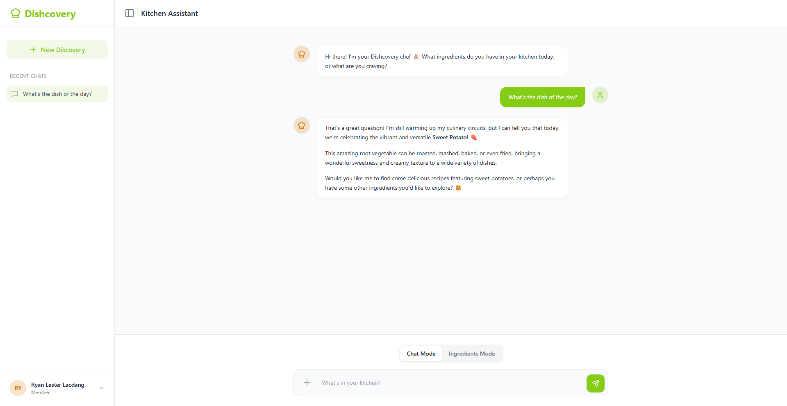
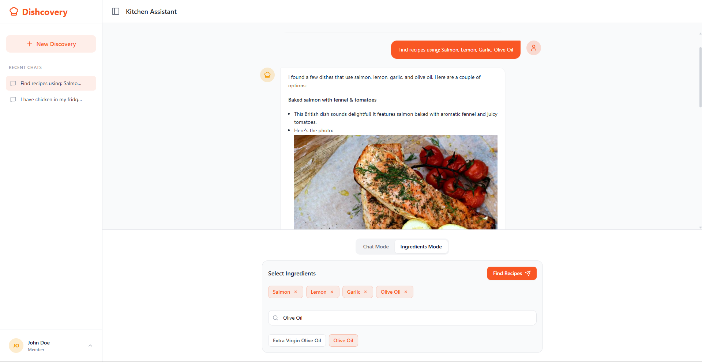

<div align="center">
    <br />
    
    <br />
    <p>Your AI-powered culinary companion for discovering your next favorite meal.</p>
</div>

---

## 🌟 Overview
**Dishcovery** is a modern web application designed to help food enthusiasts find recipes based on what they already have in their kitchen. By leveraging the power of **Google Gemini** and **TheMealDB API**, it provides a conversational and interactive experience to transform simple ingredients into delicious dishes.

## 📸 Screenshots

### **Chat Mode**
Experience a conversational AI that understands your cravings and suggests creative recipes.


### **Ingredients Mode**
Don't know what to type? Browse through over 600+ ingredients and select what's available in your pantry.


## 🛠️ Tech Stack

<div style="display: flex; align-items: center; flex-wrap: wrap; gap: 0;">
  <a href="https://flask.palletsprojects.com/" target="_blank" rel="noreferrer" style="text-decoration: none;">
    <picture>
      <source media="(prefers-color-scheme: dark)" srcset="https://cdn.simpleicons.org/flask/ffffff">
      
    </picture>
  </a><a href="https://www.python.org" target="_blank" rel="noreferrer" style="text-decoration: none;">
    
  </a><a href="https://www.mysql.com/" target="_blank" rel="noreferrer" style="text-decoration: none;">
    
  </a><a href="https://tailwindcss.com/" target="_blank" rel="noreferrer" style="text-decoration: none;">
    
  </a><a href="https://developer.mozilla.org/en-US/docs/Web/JavaScript" target="_blank" rel="noreferrer" style="text-decoration: none;">
    
  </a><a href="https://greensock.com/gsap/" target="_blank" rel="noreferrer" style="text-decoration: none;">
    
  </a>
</div>

- **Backend**: Python (Flask) with SQLAlchemy & MySQL
- **AI**: Google Gemini
- **Frontend**: Jinja2 Templates, Tailwind CSS, Vanilla JS, GSAP
- **External API**: TheMealDB

## 🚀 Key Features
- **Dual Input Modes**: Seamlessly switch between a natural language **Chat Mode** and a structured **Ingredients Mode**.
- **Visual Uploads**: Upload images of your ingredients for AI-assisted recognition.
- **Social Authentication**: Secure login via **Google** and **Facebook** OAuth integration.
- **Smart History**: Save your culinary discoveries and resume past conversations easily.
- **Responsive Design**: Modular component-based architecture built for both desktop and mobile.

## ⚙️ Setup Instructions

### 1. Prerequisites
- Python 3.8+
- MySQL Server
- API Keys for Google Gemini, Google OAuth, and Facebook OAuth

### 2. Installation
1. **Clone the repository**:
   ```bash
   git clone <repository-url>
   cd dishcovery
   ```

2. **Create and activate virtual environment**:
   ```bash
   # Windows
   python -m venv venv
   .\venv\Scripts\activate

   # macOS/Linux
   python3 -m venv venv
   source venv/bin/activate
   ```

3. **Install dependencies**:
   ```bash
   pip install -r requirements.txt
   ```

### 3. Configuration
Create a `.env` file in the root directory and fill in the following details (refer to `.env.example`):
```env
SECRET_KEY=your_secret_key
FLASK_DEBUG=True

DB_HOST=127.0.0.1
DB_PORT=3306
DB_NAME=dishcovery_db
DB_USERNAME=your_username
DB_PASSWORD=your_password

GOOGLE_CLIENT_ID=your_google_id
GOOGLE_CLIENT_SECRET=your_google_secret

FACEBOOK_CLIENT_ID=your_facebook_id
FACEBOOK_CLIENT_SECRET=your_facebook_secret

GEMINI_API_KEY=your_gemini_api_key
MEALDB_BASE_URL=https://www.themealdb.com/api/json/v1/1/
```

### 4. Run the application
```bash
python run.py
```

---

<div align="center">
  <p>Dishcovery © 2026</p>
</div>